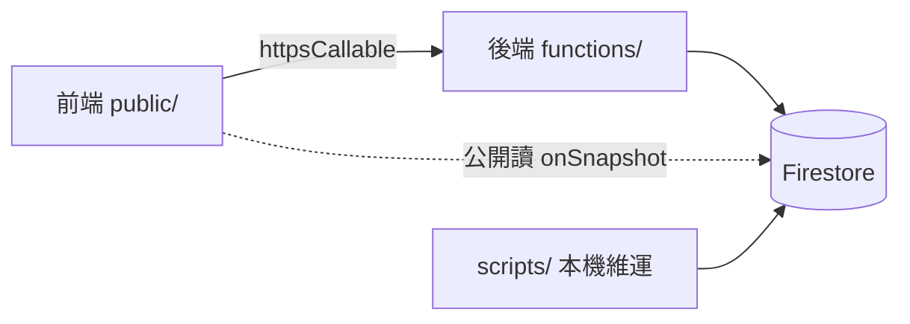

# Nuva Graduation — 架構與廢碼

> **架構單一真相來源**（更新：2026-08-01）  
> 產品規格背景：[`PRD.md`](./PRD.md)｜相對上一版：[`CHANGELOG-vs-previous.md`](./CHANGELOG-vs-previous.md)

現場活動：掃 QR → PIN 驗證 → 後端抽籤 → 組隊解謎多幕 → 終場／證書。  
**抽籤、兇手、角色池、組進度只在 Cloud Functions（Admin SDK）判定**；前端只送請求與顯示。

---

## 一、前端（`public/` → Firebase Hosting）

原生 HTML + Tailwind CDN + Vanilla JS（Firebase compat SDK）。

### 頁面

| URL | 用途 |
| --- | --- |
| `/` | 導向 `/certificate.html`（領取證書） |
| `/certificate.html` | 活動結束後領取證書（僅編號＋姓名，無需 PIN） |
| `/join.html` | 組隊大廳 |
| `/opening.html` → `/act1.html` → `/act2.html` → `/act3.html` → `/act4.html` → `/waiting.html` → `/finale.html` | 解謎各幕 |
| `/admin.html` | 管理後台（需 Auth + admin claim） |
| `/print.html` | PIN 列印 |
| `/qr.html` | 現場 QR |
| `/404.html` | 錯誤頁 |

幕順序：`lobby` → `opening` → `act1` → `act2` → `act3` → `act4` → `waiting` → `finale`

### 腳本

| 檔案 | 職責 |
| --- | --- |
| `js/config.js` | Firebase Web 設定 |
| `js/app.js` | 驗證／抽籤／結果／觸發證書 |
| `js/certificate.js` | 客戶端產生證書 PDF |
| `js/cert-claim.js` | 領取證書頁：編號＋姓名驗證後下載 |
| `js/puzzle.js` | 解謎 session、幕守衛、進度、組狀態 |
| `js/act-page.js` | 敘事幕共用（opening／act1／act3） |
| `js/admin.js` | 後台監控與操作 |

### 靜態資產（`assets/`）

- `qr.png` — QR 頁
- `第二幕判斷家謎題.png` — 第二幕
- `電子證書正式版.pdf` + `fonts/NotoSansTC-Bold-subset.ttf` — 證書

### 前端呼叫的後端函式

| 模組 | Callables |
| --- | --- |
| `app.js` | `verifyCheckin`、`drawRole`、`createPuzzleSession` |
| `puzzle.js` | `getPuzzleState`、`joinGroup`、`leaveGroup`、`advanceAct`、`submitAct4Accusation`、`createPuzzleSession`、`verifyCheckin`；（另註冊未呼叫的 `submitAct2Answer`，見廢碼） |
| `admin.js` | `ensureAdminClaim`、`resetAmbassador`、`adjustRolePool`、`exportRoster`、`exportFinalRoster`、`getKillerAssignment`、`setKiller`、`initPuzzleGroups`、`unlockOpening`、`unlockFinale`、`listPuzzleGroups`、`passAct2Role`、`designateSilencersAndUnlockAct4`、`adminMoveMember` |
| `print.html` | `exportPinRoster` |

第二幕現況：玩家看謎題、現場回報；**後台 `passAct2Role` 一鍵通過**各角色任務。

---

## 二、後端（`functions/` → Cloud Functions，`asia-east1`）

全部業務在 `functions/index.js`。

### 抽籤／身分

| 函式 | 說明 |
| --- | --- |
| `verifyCheckin` | 編號＋姓名＋PIN；已抽回查；工作人員固定身分 |
| `drawRole` | Transaction 抽角色／兇手 |
| `createPuzzleSession` | 發解謎 session（工作人員為 preview） |

### 管理（需 admin claim）

| 函式 | 說明 |
| --- | --- |
| `ensureAdminClaim` | 提升 admin claim |
| `resetAmbassador` | 重置抽籤／PIN |
| `exportPinRoster` | PIN 列印資料 |
| `getKillerAssignment` / `setKiller` | 查／指定犯人 |
| `adjustRolePool` | 調角色池 |
| `exportRoster` / `exportFinalRoster` | 匯出名單（後者含兇手） |

### 解謎／組別

| 函式 | 說明 |
| --- | --- |
| `initPuzzleGroups` | 建立／重置 G01–G15 |
| `unlockOpening` / `unlockFinale` | 全場開場／終場閘門 |
| `designateSilencersAndUnlockAct4` | 指定滅口者並解鎖第四幕 |
| `listPuzzleGroups` | 後台組列表 |
| `getPuzzleState` | 玩家狀態＋組＋全域旗標 |
| `joinGroup` / `leaveGroup` | 入組／退組 |
| `adminMoveMember` | 後台調組 |
| `advanceAct` | 推進組進度 |
| `submitAct4Accusation` | 第四幕指認 |
| `passAct2Role` | 後台通過第二幕某角色任務 |
| `submitAct2Answer` | 舊線上驗答（前端已不用） |
| `setPuzzleAnswers` | 寫入 act2 標準答案（無 UI） |

### HTTP

| 函式 | 說明 |
| --- | --- |
| `health` | 探活 JSON；repo 內無呼叫 |

### 本機維運（不上線，屬後端資料準備）

| 指令 | 作用 |
| --- | --- |
| `scripts` → `npm run seed` | 匯入大使、PIN、角色池 |
| `npm run mark-attendance` | 標記出席 |
| `npm run mark-staff` | 固定工作人員 |
| `npm run create-admin` | 建管理員帳號 |

輸入 CSV：`scripts/data/ambassadors.csv`（fallback：`大使名單-工作表1.csv`）、`attendees.csv`、`staff.csv`。  
機密產出：`scripts/output/`（gitignore）。

---

## 三、資料庫（Firestore）

規則：`firestore.rules`。專案：`nuva-guraduation`。

| Collection | Client 讀 | Client 寫 | 用途 |
| --- | --- | --- | --- |
| `ambassadors_public` | 公開 | 禁止 | 姓名、角色、`is_drawn`、`is_attending`、`is_staff`、`group_id` |
| `ambassadors_secret` | 禁止 | 禁止 | `is_killer` 等 |
| `checkin_codes` | 禁止 | 禁止 | PIN、`used` |
| `system_config/main` | 僅 admin | 禁止 | 角色池、犯人設定、`puzzle.*` |
| `groups/{G01–G15}` | 公開 | 禁止 | 組碼、槽位、成員、`currentAct`、`act2`、`act4` |
| `group_codes/{code}` | 禁止 | 禁止 | code → `group_id` |
| `puzzle_sessions/{token}` | 禁止 | 禁止 | 解謎短時登入（TTL 12h） |

### `system_config/main` 重點

- `role_pool.remaining` — 角色剩餘名額  
- `killer.mode` / `killer.remaining` — 犯人模式  
- `puzzle.openingUnlocked` / `act4Unlocked` / `finaleUnlocked`  
- `puzzle.silencers`、`act4ClearCount`  
- `puzzle.answers` — `{ taster, judge }`（僅後端；現況多為 placeholder）

索引：`firestore.indexes.json` 目前為空（尚未需要複合索引）。

---

## 四、廢碼狀態

### 已刪除（確認廢碼，2026-08-01）

| 項目 | 動作 |
| --- | --- |
| `passAct2Strongmen` | 已自 `functions/index.js` 移除（由 `passAct2Role` 取代） |
| `scripts/data/nuvacampus_結業典禮參加者名單_2026-07-13.csv` | 已刪（無腳本讀取的備份） |
| `scripts/skills-lock.json` | 已刪（與根目錄重複） |
| `puzzle.js` 死選擇器 `#taste-form` 等 | 已清，僅保留 `[data-preview-hide]` |

### 仍保留的可疑未用

| 項目 | 說明 |
| --- | --- |
| `submitAct2Answer` | Functions 仍在；`puzzle.js` 有註冊、無呼叫 |
| `setPuzzleAnswers` | 無後台 UI |
| `health` | 可能供人工探活 |
| `puzzle.answers` 鏈 | 與線上驗答綁定；現況 UX 幾乎不用 |

### 過時文件／參考資產（未刪）

| 項目 | 說明 |
| --- | --- |
| `docs/PRD.md` 部分章節 | Callable 列表、第二幕描述、Vercel 等落後 |
| `scripts/data/謎題內容.pdf` | 企劃參考，無 runtime 引用 |
| `docs/CHANGELOG-vs-previous.md` | 僅涵蓋工作人員那版差異 |

若確定永不線上驗答，可再下線 `submitAct2Answer`／`setPuzzleAnswers`／`puzzle.answers`。
